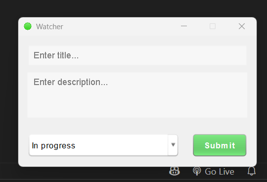
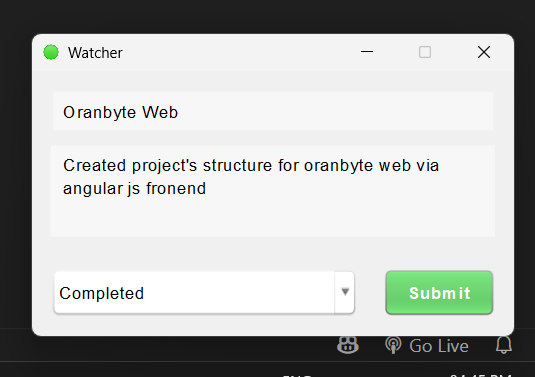
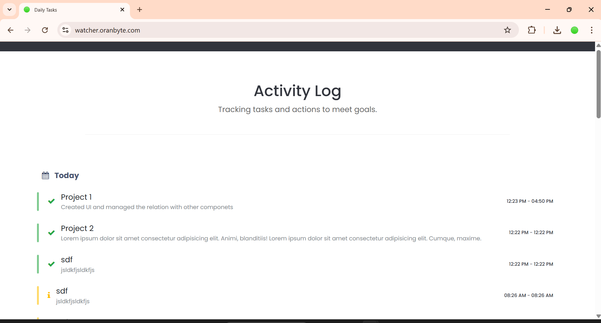

# 👁️ Watcher User Side

I created this to tell me write your daily tasks to get informed about your progress...

## 🔗 Resource
This is just the implementation of user side : The server side script of php project available at 
[Watcher Server Side](https://github.com/suraj-repositories/watcher-server-side)

## 🔋 Technology used
 - Java 22
 - Java Swing

## 🍈 Screenshots

    

        
        
    

    

 #### Server side application images

 

    

        
    

    

 

## ❤️ Contributing

Pull requests are welcome. For major changes, please open an issue first
to discuss what you would like to change.